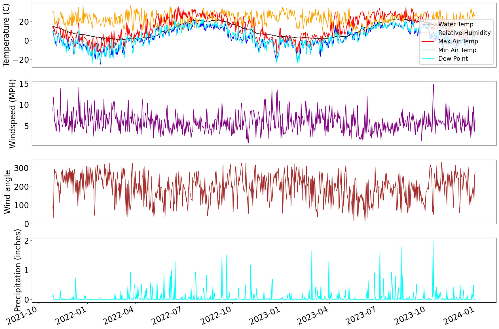
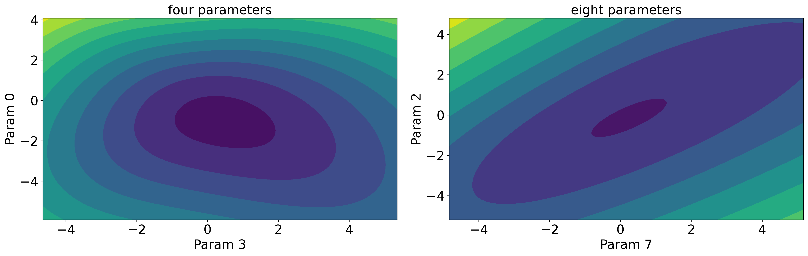
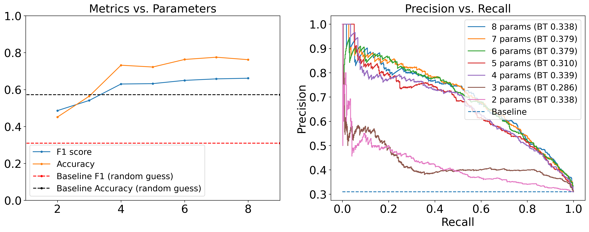
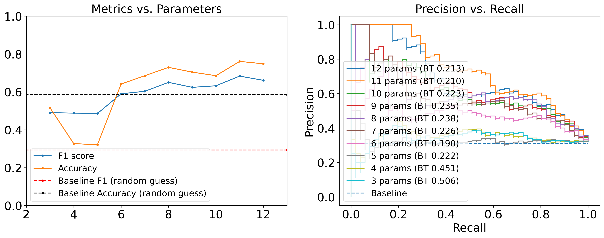
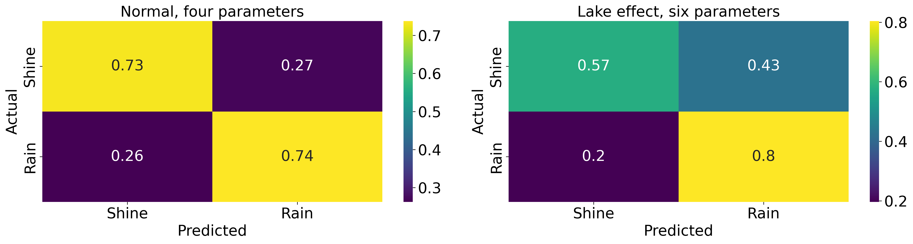

# Quantifying the Lake Effect in Sheboygan
Predicting lake-effect precipitation patterns in Sheboygan, Wisconsin using a simple Markov model and data from NOAA buoys and airport weather stations.

[Jump to Repo Organization](#repository-layout)

## Overview of project
### Motivation
There is perhaps no greater fodder for small talk in Sheboygan than the storied “Lake Effect.” All weather changes, both gradual and sudden, are attributed at some point to the lake effect, which is the blanket name for the kinds of weather phenomena directly related to Sheboygan’s proximity to the great lake Michigan. It has such a powerful hold on the public’s imagination that a radio station, a line of merch, and a cafe are all named after it.


It is well documented that cities along Michigan’s western coastline receive more precipitation. The question this poster attempts to answer is how the lake factors in when predicting whether precipitation will fall on a given day in Sheboygan, Wisconsin.

### Data
The data used for this project was procured from three sources: An airport weather station whose data is hosted at Iowa State<sup>1</sup>, an NDBC buoy near Sheboygan<sup>2</sup>, and a GLSEA databank<sup>3</sup>. All atmospheric and lake-observation datasets (ASOS, NDBC SGNW3, and GLSEA) originate from NOAA observational or research programs. Missing and/or faulty data was an issue for the buoy and GLSEA data. The weather station consisted of daily values (averages, maximum, and minimum) while the other sources consisted of hourly values. These data sources required some cleaning before they were useful for making predictions. For initial data cleaning see [this notebook](src/code/data_cleanup.ipynb).



The features I used for fitting a predictive model are **Day of the Year** to capture seasonality, **whether it rained/snowed the previous day**, **Avg. Relative Humidity**, **Maximum Dew point**, **Minimum Dew point** (from weather station), **Avg. Air Pressure**, **Avg. Windspeed**, **Avg. Wind Direction** (from buoy 1), and **Average Water Temperature** near shore (from buoy 2).

Unfortunately, the only water temperature data available only covers October 2021 - December 2024. This was much more limited than the rest of the features, and as such, when factoring in lake effect the model is fit on a much smaller dataset.

### Training and Reducing Models
I aimed to predict the binary label precipitation / no precipitation, based on the features mentioned in the previous section. For a explanation of the method of logistic regression, see [here](src/write-up/log-reg.md).

I fit two logistic regression models; one excluding features directly related to the lake, and one including features directly related to the lake.

#### Logistic Regression without Lake Effect
The original bucket of models through which I searched had the following form:
$$P(Y=1) = \text{logit}^{-1}(\beta_0+\beta_1\sin(\frac{2\pi d}{365}) + \beta_2\cos(\frac{2\pi d}{365}) + \beta_3r_{t-1} + \beta_4h + \beta_5p + \beta_6v + \beta_7\rho)$$

Where $d$ is day of the year, $r_t−1$ is a binary indicator of whether it rained the day before, $h$ is the relative humidity, $p$ is the pressure, $v$ is windspeed, and $\rho$ is the dew point. I implemented a [custom class](src/code/helper.py#L153) that to find the optimal model minimizing the above objective function, and to find the hessian of the cost surface at the minimizer.



As a application of the [manifold boundary approximation method (MBAM)](https://arxiv.org/abs/1605.08705), I removed one "sloppy" parameter from the model at time by analyzing the hessian of the cost-surface and removing the parameter corresponding to the shallowest direction. I reduced the eight parameter model to a parameter with just four stiff parameters, one of which was an intercept feature. Removing any of these stiff parameters causes the model to drop steeply in accuracy.



#### Logistic Regression with Lake Effect
I also found a logistic regression fit when including lake effect factors in the model, namely water temperature, wind direction, and a blowing-on-shore binary indicator. These are represented by $w_t$, $\theta$ , and $I_O$ respectively.

$$P(Y=1) = \text{logit}^{-1}(\beta_0+\beta_1\sin(\frac{2\pi d}{365}) + \beta_2\cos(\frac{2\pi d}{365}) + \beta_3r_{t-1} + \beta_4h + \beta_5p + \beta_6v + \beta_7\rho + \beta_8\sin(\theta) + \beta_9\cos(\theta) + \beta_{10}wt + \beta_{11}I_O)$$

I performed the same kind of analysis as for the previous model to remove six parameters from this 12 parameter model. However there is still one sloppy parameter in the six parameter model, but removing it greatly reduces the accuracy of the predictions. The process of removing six parameters also hurt the predictive power of the model more than in the previous model.



### Results
The four parameter normal model performed better than the six parameter lake effect model, with respective accuracies of 74.84% and 64.15% and respective F1 scores of 0.7260 and 0.5899. However, the lake effect model was trained on a dataset less than a tenth the size of the normal model. When training on a dataset the same size as the lake effect model, the normal model achieved similar accuracy of about 74%.



The sloppy model analysis revealed that many of the periodic features were redundant and dependent on one another, and only one was needed. Interestingly, the steep variables in the normal model were not the steep variables in the lake effect model. The normal model was reduced from 11 parameters to four via sloppy analysis, and the lake effect model from 12 to six. A major issue with the method I used is that there is no way to separate the lake effect from any variables I used, even in the normal “non-lake” model.

### Future Work
This project suffered from a lack of complete historical data. Improved future efforts will depend on the accuracy and availability of more complete data, such as for water temperature. Most features I wanted in my model were available, but a more complete model would also include
temperatures at several altitudes to capture effects from convection, as well as fetch length of wind over the lake.

Nonetheless this is a fun dataset that is well equipped for lots of different kinds of models. As part of my exploration, I created a simple binary Markov chain model. More complicated kinds of Markov chains could be explored. I would also like to train ARIMA/SARIMA models, which are typical time-series models. In a different direction, regression on the amount of precipitation when it does fall could be a fruitful direction.

Gratifyingly a naively trained RandomForestClassifier from scikit-learn underperformed both logistic regression models, with accuracy 63% and F1 score of 0.57.

## Sources
[1] Iowa Environmental Mesonet. (2000–2024). SBM ASOS daily climate data (WI_ASOS). Iowa State University. Retrieved from https://mesonet.agron.iastate.edu/  
[2] National Data Buoy Center. (2000–2024). SGNW3 – Sheboygan, WI nearshore environmental data. NOAA. Retrieved from https://www.ndbc.noaa.gov/.  
[3] NOAA Great Lakes Environmental Research Laboratory. (2000–2024). Great Lakes Surface Environmental Analysis (GLSEA) water temperature. NOAA GLERL. Retrieved from https://www.glerl.noaa.gov/  


## Repository Layout
The heavy lifting of this project is all in `src/`. It is split up between code, which includes figures I made for the poster and this README, the data I use for the project, and more in-depth explanations of different parts of the project, which I will reference in this README as I write them.
```
.
├── README.md
├── TODO.md
├── .gitignore
├── venv/
├── src/
│   ├── code/
│   │   ├── __pycache__/
│   │   ├── figures/
│   │   │   └── ...             # Figures for poster and README
│   │   ├── data_cleanup.ipynb
│   │   ├── data_viz.ipynb
│   │   ├── helper.py
│   │   ├── logistic_regression.ipynb
│   │   └── simple_rain_shine_markov.ipynb
│   │
│   ├── data/
│   │   └── ...                 # CSV files
│   │
│   └── write-up/
│       ├── images/
│       │   └── ...             # Images for write-up
│       └── log-reg.md
```