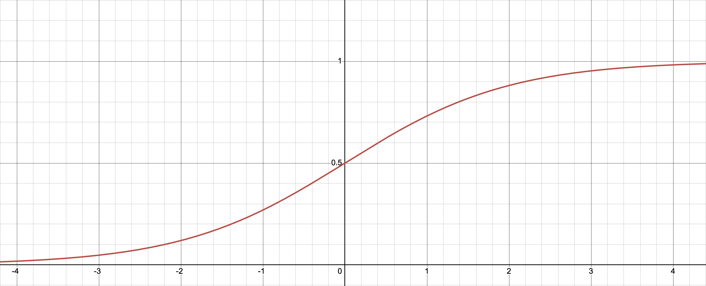

Let us define $Y$ as the random variable signifying whether it rains or not. Thus it is binary with support ${0, 1}$. $Y$ is conditioned on another random variable $X$, with support in $\mathbb{R}^d$. The distribution of $Y$ given $X$ is assumed to be Bernoulli:
$$Y | X \sim Bernoulli(sigm(X^T\beta))$$
Where $\beta$ is our vector of parameters and 
$$sigm(x) = \frac{1}{1 + e^{-x}}$$

It's as if we have a family of Bernoulli random variables "indexed" by instances of data. When we fit a logistic regression model, we are matching data instances to their Bernoulli random variable.

Given a draw of length n of the form $D = {(\textbf{x}_1, y_1), ..., (\textbf{x}_n, y_n)}$ we with to estimate $\beta$. We will use the maximum likelihood estimator. The likelihood of $\beta$ is given by 
$$ L(\beta | D) = \prod_{i = 1}^n P(Y = y_i, X = x_i |\beta)$$
$$ = \prod_{i = 1}^n P(Y = y_i| X = x_i, \beta)P(X_i)$$
which is equivalent to maximizing 
$$ \prod_{i = 1}^n P(Y = y_i| X = x_i, \beta) = \prod_{i = 1}^n p_i^{y_i}(1 - p_i)^{1 - y_i}$$
where
$$p_i = P(Y = 1 | \textbf{x}_i,\beta) = sigm(\textbf{x}_i^T\beta) = \frac{1}{1 + \text{exp}(\textbf{x}_i^T\beta)}$$
taking the negative logarithm, this becomes a convex minimization problem.
$$\ell (\beta | D) = \sum_{i = 1}^n(y_i\log(1 + \text{exp}(-\textbf{x}_i^T\beta)) + (1 - y_i)\log(1 + \text{exp}(\textbf{x}_i^T\beta)))$$
Now, defining $z_i = \textbf{x}_i^T\beta$, we may rewrite as
$$\ell (\beta | D) = \sum_{i = 1}^n(y_i\log(1 + \text{exp}(-z_i)) + (1 - y_i)\log(1 + \text{exp}(z_i)))$$
Now observe that 
$$\log(1 + e^{-z_i}) = \log(\frac{1 + e^{z_i}}{e^{z_i}}) = \log(1 + e^{z_i}) - z_i$$
So
$$ y_i \log(1 + e^{-z_i}) = y_i[\log(1 + e^{z_i}) - z_i] = y_i \log(1 + e^{z_i}) - y_iz_i$$
Plugging this back into our initial term in the sum, we see

$$
\begin{aligned}
y_i\log(1 + \text{exp}(-z_i)) + (1 - y_i)\log(1 + \text{exp}(z_i)) 
    &= y_i\log(1 + e^{z_i}) - y_iz_i + (1 - y_i)\log(1 + e^{z_i}) \\
    &= (y_i + 1 - y_i)\log(1 + e^{z_i}) - y_iz_i \\
    &= \log(1 + e^{z_i}) - y_iz_i \\
\end{aligned}
$$

And our final objective function to minimize is 
$$ \ell(\beta|D) = \sum_{i = 1}^n \log(1 + e^{z_i}) - y_iz_i$$